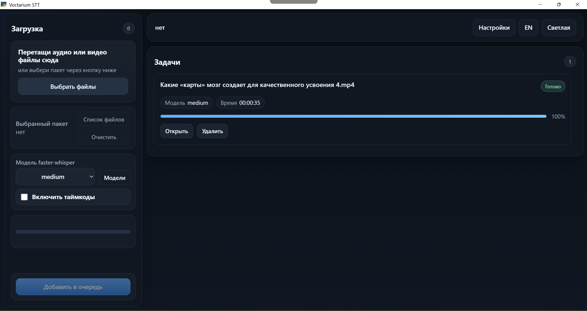
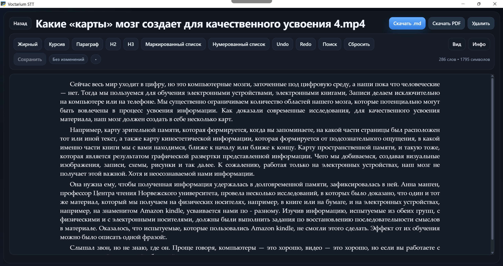

# Voctarium STT

[](https://github.com/aztechell/Voctarium/releases/latest)
[](https://www.python.org/)
[](https://github.com/aztechell/Voctarium)
[](LICENSE)

Локальное Windows-приложение для расшифровки аудио и видео на базе `faster-whisper` с очередью задач, менеджером моделей, встроенным редактором читабельного текста и desktop-режимом через `pywebview`.

## Текущее состояние продукта

- один движок распознавания: `faster-whisper`
- локальный менеджер моделей `tiny`, `base`, `small`, `medium`, `large-v3`, `turbo`
- очередь с одной активной задачей и ожидающими задачами
- статусы задач: `queued | processing | done | cancelled | failed`
- desktop-режим в одном native WebView-окне
- один пользовательский результат на задачу: `readable`
- встроенный редактор читабельного текста с автосохранением
- встроенный аудиоплеер с waveform, навигацией по таймкоду и синхронной подсветкой предложений
- экспорт в `.md` и `.pdf`
- глобальные desktop-настройки очистки runtime-данных между сессиями
- переключение языка интерфейса `RU/EN` и светлой/темной темы на dashboard

В проекте больше нет TTL/`expired`-статуса: задача и результат живут, пока пользователь сам их не удалит или пока не сработает явная cleanup-настройка desktop-режима.

## Скриншоты

### Dashboard



### Редактор результата



## Требования

- Windows
- Python `3.11`
- Microsoft Edge WebView2 Runtime
- для комфортной работы `faster-whisper` желательно иметь NVIDIA GPU

## Быстрый старт

Подготовить локальные зависимости и ассеты:

```powershell
powershell -ExecutionPolicy Bypass -File .\scripts\setup_assets.ps1
```

Минимальный путь для свежего clone:

1. склонировать репозиторий
2. запустить `scripts\setup_assets.ps1`
3. запустить `scripts\run_desktop.ps1`

После этого можно запустить либо web/API-режим:

```powershell
.\.venv311\Scripts\python.exe -m uvicorn app.main:app --host 127.0.0.1 --port 8000
```

либо desktop-режим:

```powershell
powershell -ExecutionPolicy Bypass -File .\scripts\run_desktop.ps1
```

## Подготовка ассетов

Скрипт [scripts/setup_assets.ps1](C:/Users/aztec/Projects/Voctarium/scripts/setup_assets.ps1) подготавливает локальную runtime-среду:

- создает `.venv311`
- ставит зависимости из `requirements.txt`
- ставит CUDA wheels для `ctranslate2`
- скачивает `bin\ffmpeg.exe`
- скачивает `models\faster-whisper-medium`
- скачивает `models\rupunct-big`
- прогревает `faster-whisper medium`, если не указан `-SkipWarmup`

Полезные флаги:

```powershell
# форсировать повторную загрузку ffmpeg
powershell -ExecutionPolicy Bypass -File .\scripts\setup_assets.ps1 -ForceDownload

# пропустить warmup faster-whisper
powershell -ExecutionPolicy Bypass -File .\scripts\setup_assets.ps1 -SkipWarmup
```

## Запуск API

```powershell
.\.venv311\Scripts\python.exe -m uvicorn app.main:app --host 127.0.0.1 --port 8000
```

Доступные адреса:

- `http://127.0.0.1:8000`
- `http://127.0.0.1:8000/health`

## Запуск desktop-режима

Рекомендуемый запуск:

```powershell
powershell -ExecutionPolicy Bypass -File .\scripts\run_desktop.ps1
```

Прямой запуск:

```powershell
.\.venv311\Scripts\python.exe -m app.desktop_entry
```

Desktop-режим:

- открывает приложение в одном native окне
- хранит runtime-данные в `runtime_root\storage`
- использует `storage\app_state.json` для active model и desktop-настроек
- может сохранять историю задач между сессиями
- не удаляет результаты автоматически по времени

## Сборка `.exe`

```powershell
powershell -ExecutionPolicy Bypass -File .\scripts\build_desktop_exe.ps1
```

Результат сборки:

- `dist\Voctarium\Voctarium.exe`
- `dist\Voctarium-v0.3.0-ml-runtime.zip`

В основной build-каталог копируется только `dist\Voctarium\bin\ffmpeg.exe`.
Тяжелые зависимости `Torch`, `Transformers` и NVIDIA CUDA DLL выносятся в
отдельный ML runtime-архив. При первом запуске release-сборка автоматически
скачивает и распаковывает его рядом с приложением.

Модели `faster-whisper` в release-архив не входят: нужная модель устанавливается
вручную через менеджер моделей в Dashboard.

## Менеджер моделей `faster-whisper`

Dashboard работает только с локально установленными моделями.

- активная модель хранится в `storage\app_state.json`
- новая задача фиксирует выбранный `model_id`
- `retry` использует исходный `model_id`
- если модель задачи удалена, `retry` вернет `409`
- если активная модель удалена, активный выбор сбрасывается в `null`
- пока активная модель не выбрана или не установлена, постановка в очередь блокируется

Каталог моделей:

- `tiny`
- `base`
- `small`
- `medium`
- `large-v3`
- `turbo`

Модель по умолчанию в локальной подготовке ассетов:

- `medium`

## Результат и встроенный редактор

У успешной задачи есть один пользовательский документ: `readable`.

Доступные представления:

- `readable.md`
- `readable.preview`
- `readable.pdf`

Страница результата сейчас работает как readable-only редактор:

- воспроизведение исходного аудио или извлеченной аудиодорожки видео
- waveform с перемоткой и синхронной подсветкой текущего предложения
- переход к нужному фрагменту аудио по клику на текст
- редактирование прямо в интерфейсе
- `Жирный`, `Курсив`, `H2`, `H3`, списки
- `Undo / Redo`
- поиск по документу
- `Сбросить` к базовому автоматически сгенерированному варианту
- явная кнопка `Сохранить` и автосохранение
- экспорт в `.md` и `.pdf`

Параметры отображения редактора:

- размер шрифта в `px`
- межстрочие
- ширина текста
- выравнивание
- пустая строка между абзацами

Пользовательские правки хранятся отдельно от базового автоматически созданного файла. Экспорт берет сохраненный override, если он существует.

PDF-экспорт нормализован под документ для чтения:

- сверху по центру ставится оригинальное имя файла
- в PDF не выводится служебная markdown-шапка
- рендерится только основной текст документа

## Desktop-настройки

Глобальные настройки приложения доступны на dashboard через кнопку `Настройки`.

Сейчас поддерживаются два runtime-параметра:

- `cleanup_uploads_on_close = true`
- `cleanup_queue_on_close = false`

Они хранятся в `storage\app_state.json`.

Смысл параметров:

- `cleanup_uploads_on_close` очищает `storage\uploads` и временные рабочие файлы при закрытии
- `cleanup_queue_on_close` очищает историю задач и `storage\results` при закрытии
- если `cleanup_queue_on_close = false`, история задач и результаты сохраняются между desktop-сессиями

## E2E-проверка

```powershell
powershell -ExecutionPolicy Bypass -File .\scripts\e2e_check.ps1
```

Запуск с собственным входным файлом:

```powershell
powershell -ExecutionPolicy Bypass -File .\scripts\e2e_check.ps1 -InputPath ".\test-input\my-file.mp4"
```

Скрипт:

1. по умолчанию берет самый крупный поддерживаемый media-файл из `test-input\`
2. поднимает API на `127.0.0.1:8000`
3. запускает smoke-задачу на коротком клипе
4. запускает полный прогон на полном файле
5. сохраняет результаты и метрики в `storage\e2e\`

Артефакты:

- `storage\e2e\smoke.md`
- `storage\e2e\full.md`
- `storage\e2e\metrics.json`
- `storage\e2e\uvicorn.stdout.log`
- `storage\e2e\uvicorn.stderr.log`

## HTTP API

- `GET /` - dashboard
- `GET /jobs/{job_id}` - страница результата
- `GET /health` - healthcheck
- `POST /api/jobs` - создать задачу (`file`, optional `model_id`, `include_timestamps`)
- `GET /api/jobs?limit=...` - список задач
- `GET /api/jobs/{job_id}` - payload задачи
- `GET /api/jobs/{job_id}/source` - исходный медиафайл с поддержкой HTTP Range
- `GET /api/jobs/{job_id}/source-audio` - аудиодорожка для встроенного плеера
- `GET /api/jobs/{job_id}/waveform` - нормализованные пики waveform
- `GET /api/jobs/{job_id}/sync/readable` - таймкоды предложений для синхронизации текста
- `POST /api/jobs/{job_id}/retry` - повторный запуск из сохраненного исходника
- `POST /api/jobs/{job_id}/cancel` - остановить активную задачу
- `DELETE /api/jobs/{job_id}` - удалить задачу и ее файлы
- `GET /api/models/faster-whisper` - каталог моделей и их runtime-статус
- `POST /api/models/faster-whisper/install` - установить модель
- `POST /api/models/faster-whisper/select` - выбрать активную модель
- `DELETE /api/models/faster-whisper/{model_id}` - удалить модель
- `GET /api/settings/desktop` - прочитать desktop-настройки
- `PUT /api/settings/desktop` - сохранить desktop-настройки
- `GET /api/jobs/{job_id}/documents/readable` - получить текущий readable-документ
- `PUT /api/jobs/{job_id}/documents/readable` - сохранить readable override
- `DELETE /api/jobs/{job_id}/documents/readable` - удалить readable override и вернуться к базовому тексту
- `GET /api/jobs/{job_id}/readable.md` - скачать markdown
- `GET /api/jobs/{job_id}/readable.preview` - HTML preview
- `GET /api/jobs/{job_id}/readable.pdf` - PDF-экспорт

## Переменные окружения

- `VOCTARIUM_RUNTIME_ROOT` - корневой runtime-каталог приложения
- `VOCTARIUM_RESOURCE_ROOT` - корневой каталог ресурсов
- `VOCTARIUM_STORAGE_DIR` - каталог `storage`
- `VOCTARIUM_FFMPEG_PATH` - путь к `ffmpeg.exe`
- `VOCTARIUM_FASTER_WHISPER_MODEL` - fallback-модель `faster-whisper`
- `VOCTARIUM_FASTER_WHISPER_DEVICE` - устройство для `faster-whisper`
- `VOCTARIUM_RUPUNCT_MODEL_PATH` - путь к модели `RUPunct`
- `VOCTARIUM_READABLE_PUNCT_DEVICE` - устройство для punctuation/post-processing
- `VOCTARIUM_CLEANUP_INTERVAL_SECONDS` - интервал фоновой housekeeping-задачи

## Что хранить в Git

Репозиторий рассчитан на source-only публикацию. В Git не должны попадать:

- `.venv311/`
- `models/` с самими весовыми файлами
- `bin/`
- `storage/results/`
- `storage/uploads/`
- `storage/work/`
- `storage/app_state.json`
- `storage/job_history.json`
- `test-input/`
- desktop build-артефакты и логи

В репозитории имеет смысл держать только исходники, тесты, скрипты, конфиги и документацию.
